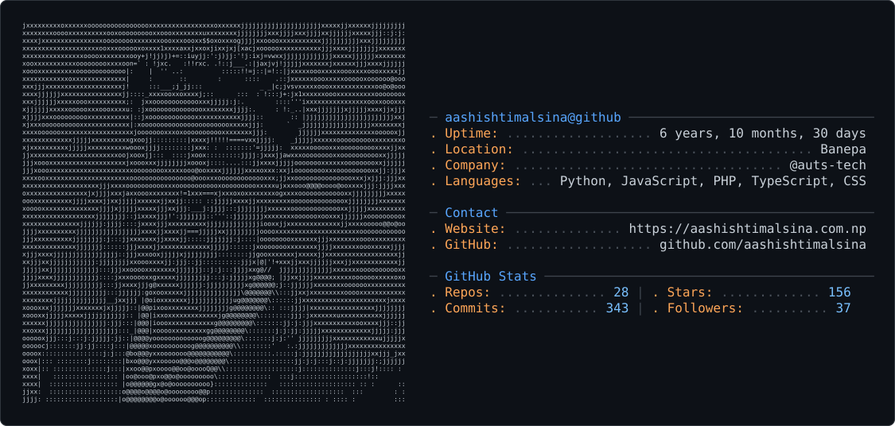

<picture>
  <source media="(prefers-color-scheme: dark)" srcset="dark_mode.svg" />
  <source media="(prefers-color-scheme: light)" srcset="light_mode.svg" />
  
</picture>

# Hi 👋, I'm Aashish Timalsina

### Full-Stack Software Developer | Flutter Developer | AI/ML Enthusiast

💻 Passionate about building scalable web, mobile, and AI-powered applications using modern technologies.

## 🚀 Tech Stack

- **Frontend:** React, Next.js, Vue.js, Tailwind CSS
- **Backend:** Laravel, Node.js, Django, FastAPI
- **Mobile:** Flutter, Dart
- **Database:** MySQL, PostgreSQL, MongoDB, Redis
- **Languages:** PHP, JavaScript, TypeScript, Python, Dart
- **Tools:** Git, Docker, Linux, Nginx

## 🌱 Currently Working On

- 🚀 SaaS & Enterprise Applications
- 📱 Cross-platform Mobile Apps with Flutter
- 🤖 AI/ML & Automation Solutions
- ☁️ Cloud Deployment & DevOps

## 📫 Connect With Me

- 🌐 Portfolio: https://aashishtimalsina.com.np
- 💼 LinkedIn: https://linkedin.com/in/aashish-timalsina-4b8156206
- 🐙 GitHub: https://github.com/aashishtimalsina
- ✉️ Email: tm.aashish1@gmail.com

---

